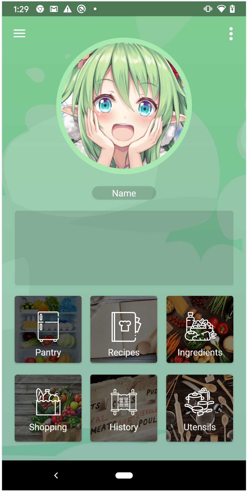

# quoridge

Quoridge is the name of Mobile application that tracks food in your pantry and will notify when any of your food is nearly being expired so that way you can know to eat before its expiration to avoid waste. It also allows you to view list of food in your pantry while you are shopping groceries in case you forget what to buy.

The application is currently in development with Xamarin (C#). Somehow, I'm planning to switch to Android Studio and XCode to develop the native Android and iOS application in the future.

  
  
  

    
  

